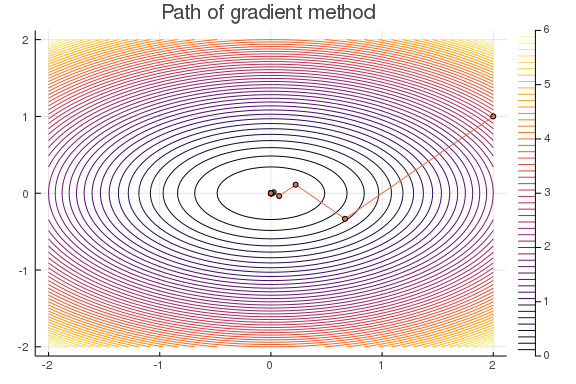
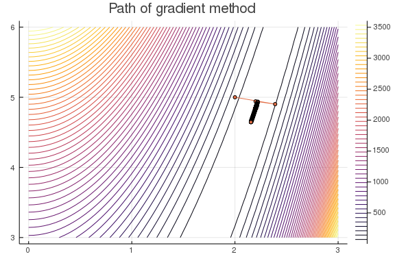

# **Gradient Descent**


## **Descent Directions**
In this lecture we will consider unconstrained nonlinear optimization of the form

$$\minimize_{\vx\in\R^n} f(\vx)$$

where $f:\R^n \rightarrow \R$ is continuously differentiable and study an iterative algorithm that solves it. We will consider an iterative algorithm of the form

$$\vx^{k+1} = \vx^k + \alpha^k \vd^k, \quad k = 1,2,\dots$$

where $\vd^k$ and $\alpha^k$ are search direction and step length, respectively, at the $k$th iteration of the algorithm. A seach direction $\vd \neq 0$ is a descent direction for $f$ at $\vx$ if the directional derivative is negative, i.e.,

$$ f'(\vx;d) = \nabla f(x)\trans \vd <0.$$ 


$\lemma{1}$ If $f$ is continously differentiable and $\vd$ is a decent direction at $\vx$, then for some $\epsilon >0$, we have 

$$f(\vx+\alpha\vd) < f(\vx), \quad \forall \alpha\in(0,\epsilon].$$

$\proof$ (Idea) Because $f'(\vx;\vd)<0$, we get 

$$\lim_{\alpha \searrow 0} \frac{f(\vx+\alpha\vd-f(\vx)}{\alpha}  \equiv f'(\vx;\vd)<0$$

So, there exists $\epsilon >0$ such that $\frac{f(\vx+\alpha\vd-f(\vx)}{\alpha}<0$ for all $\alpha \in (0,\epsilon]$.


The general outline of decent scheme is:

----
**Descent scheme outline**

Initialization: choose $\vx^0 \in \R^n$

For $ k = 0,1,2,\dots

1. compute descent direction $\vd^k$

2. compute step size $\alpha^k$ such that $f(\vx^k +\alpha^k\vd^k)< f(x^k)$

3. update $\vx^{k+1}  = \vx^k +\alpha^k \vd^k$

4. check stopping criteria

----

Each step in the above gradient descent scheme raises a few important question:

1. How to determine a starting point?

2. What are advantages/disadvantages of different directions $\vd^k$?

3. How to compute a step length $\alpha^k$?

4. when to stop?

## **Stepsize selection**

These are the selection rules most used in practice:

1. Constant stepsize: Here, we fix an $\bar{\alpha}$ and choose $\alpha^k = $\bar{\alpha}$ for all $k$.

2. Exact linesearch: In exact linesearch, we choose $\alpha^k$ to minimize $f$ along a ray $\vd^k$ starting at $\vx^k$, i.e.

    $$ \alpha^k = \argmin_{\alpha\geq 0} f(\vx^k+\alpha \vd^k)$$

3. Backtracking "Armijo" linesearch: For some parameter $\mu \in (0,1)$, reduce $\alpha$ (eg, $\alpha \leftarrow \alpha/2$ begining with $\alpha = 1$) until the following sufficient decrease property is satisfied

    $$ f(\vx^k) - f(\vx^k + \alpha d^k) \geq -\mu \alpha \nabla f(\vx^k)\trans\vd^k$$

    <center>
         
    </center>

    In the above figure, $\alpha_3$ and $\alpha_4$ satisfy the sufficient decrease property.

$\exa{(Exact linesearch for quadratic functions)}$ An exact linesearch is typically only possible for quadratic functions:

$$f(\vx) = \frac{1}{2}\vx\trans\mA\vx +\vb\trans\vx + c$$

with $\mA \succ 0$. Exact line search solves the 1-dimensional optimization problem

$$\min_{\alpha\geq 0} f(\vx + \alpha \vd)$$

where $\vd$ is a descent direction, and both $\vx$ and $\vd$ are fixed. In the quadratic case, we have

$$f(\vx+\alpha\vd) = \frac{1}{2}(\vx+\alpha \vd)\trans\mA(\vx+\alpha \vd) + \vb\trans(\vx+\alpha\vd)+c.$$

Since the gradient of $f(\vx+\alpha\vd)$ w.r.t. $\alpha$ is 

$$ \frac{d}{d\alpha}f(\vx+\alpha\vd) = \alpha\vd\trans\mA\vd+\vx\trans\mA\vd+\vb\trans\vd = \alpha\vd\trans\mA\vd + \nabla f(\vx)\trans\vd,$$

the optimal $\alpha = -\frac{\nabla f(\vx)\trans\vd}{\vd\trans\mA\vd}$, which is always positive under the assumption that $\mA \succ 0$.

## **Search Directions**

The simplest search direction provides the gradient descent algorithm. In gradient descent, the search direction $\vd^k : = -\vg_k$, where $\vg_k = \nabla f(\vx^k)$. It is easy to see that the negative gradient descent direction $-\vg_k$ provides a descent direction. To show that $-\vg_k$ is a descent direction, consider

$$ f'(\vx^k;\vg_k) = -\vg_k\trans\vg_k = -\|\vg\|_2^2.$$

If $\vg_k \neq 0$, i.e. $\vx^k$ is not a stationary point, then $-\|\vg\|_2^2 <0$. The negative gradient is also called the steepest descent direction of $f$ at $\vx$. We say $\vd$ is the steepest descent direction if it solves

$$\min\{f'(\vx;\vd) : \|\vd\| = 1\}.$$

The gradent descent algorithm is:

----
**Gradient descent**

Input: $\epsilon >0$ (tolerance), $\vx_0$ (starting point)

For $k = 0,1,2,\dots$
 
1. evaluate gradient $\vg^k = \nabla f(\vx^k)$

2. choose step length $\alpha^k$ based on reducing the function $\phi(\alpha) = f(\vx^k-\alpha\vg^k)$

3. set $\vx^{k+1} = \vx^k -\alpha^k \vg^k$

4. stop if $\|\nabla f(\vx^{k+1})\|<\epsilon$.

----

Below is a Julia implementation of gradient method with exact linesearch for minimizing quadratic functions of the form $f(\vx) = \frac{1}{2}\vx\trans\mA\vx + \vb\trans\vx$. We use gradient method with exact linesearch to minimize $f(x,y) = x^2+2y^2$ starting at $(x_0,y_0) = (2,1)$.

````julia
function grad_method_exact_ls(A, b, x0, ϵ=1e-6)
    x = copy(x0)
    ∇f = A*x + b
    k = 0
    xtrace = x'
    while norm(∇f) > ϵ
        α = dot(∇f,∇f) / dot(∇f,A*∇f)
        x = x - α*∇f
        ∇f = A*x + b
        f = (1/2)x'*A*x + b'*x
       # @printf "it = %3d | |∇f| = %8.2e | f = %8.2e\n" k norm(∇f) f
        k += 1
        xtrace = vcat(xtrace,x')
    end
    return xtrace
end

#Apply to f(x) = x^2+2y^2
A = [1 0;0 2]
b = [0, 0]
x0 = [2, 1]
xtrace = grad_method_exact_ls(A, b, x0);

# contour plot
f(x1,x2) = (1/2)*[x1, x2]'*A*[x1, x2]+b'*[x1,x2]
x1 = -2:0.05:2
x2 = -2:0.05:2;
contour(x1, x2, f, levels = 50)
plot!(xtrace[:,1], xtrace[:,2], marker = 3 ,legend = false, title = "Path of gradient method")
````





## **Convergence of gradient method with constant stepsize**

In gradient method with constant stepsize, we set $\alpha)k = \bar{\alpha}$ for all iterations. Naturally, the convergence and convergence rate of gradient method with constant stepsize is depends on the size of the constant $\bar{\alpha}$. If $\bar{\alpha}$ is small then gradient method will likely converge (assuming the function is well-behaved), however the convergence will be slow. On the other hand, if the $\bar{\alpha}$ is large, gradient method can diverge. So, we must choose a stepsize $\bar{\alpha} \in (0,\alpha_{\text{max}})$ for the method to converge. This $\alpha_{\text{max}}$ will depend on a property of $∇f$ called Lipschitz continuity.

----
**_Definition_** (Lipschitz continuity of gradient) A continuously differentiable function $f:\R^n \rightarrow  \R$ has Lipschitz continuous gradient with parameter $L$ if 

$$ \|\nabla f(\vx) - \nabla f(\vy)\|_2 \leq L \|\vx- \vy\|_2$$ 

for all vectors $\vx$, $\vy$ and some constant $L>0$.

----

**_Example_** Let $\mA$ be a PSD matrix. Let $f(\vx) = \frac{1}{2}\vx\trans\mA\vx+\vb\trans\vx+c$. The gradient is $\nabla f(\vx) = \mA\vx-\vb$ and 

$$\begin{align*} \|\nabla f(\vx) -\nabla f(\vy)\| =& \|(\mA\vx-\vb) - (\mA\vy-\vb)\|\\
=& \|\mA\vx-\mA\vy\|\\
=& \|\mA(\vx-\vy)\|\\
\leq & \|\mA\|_2\|\vx-\vy\|_2\\
\leq & \lambda_{\text{max}}(\mA) \|\vx-\vy\|_2.
\end{align*}$$

We now state a lemma that provides an upper bound on the stepsize for convergence of gradient method with constant stepsize.

----
**_Lemma_** If $f:\R^n\rightarrow \R$ has an L-Lipschitz continuous gradient and a minimizer exists, then the gradient method with constant stepsize converges if $\bar{\alpha} \in (0,2/L)$.
 
----

Using the above lemma, we can show that minimizing the quadratic $f(\vx) = \frac{1}{2}\vx\trans\mA\vx +\vb\trans\vx +c$ over $\R^n$ with $\mA = \bmat 1 & 0 \\0 & 2\emat$ converges if the constant stepsize in the gradient method satisfies $\bar{\alpha} \in (0, 1)$. This is because $\lambda_{\text{max}}(\mA) = 2$.

----
**_Lemma_** (Convergence of the gradient method) For the minimization of $f:\R^n\rightarrow\R$ bounded below with $L$-Lipschitz gradient and one of the following linsearches

1. constant stepsize $\bar{\alpha}\in(0,2?L),$

2. exact linesearch, or

3. backtracking linesearch with $\mu \in (-0,1)$,

the gradient method satisfies $f(\vx_{k+1})< f(\vx_k)$ for all $k =0,1,2,\dots$ unless $\nabla f(\vx_k)  = 0$ and $\|\nabla f(\vx_k)\| \rightarrow 0$ as $k \rightarrow \infty$.

----

## **Condition number of a matrix**

The condition number of a $n\times n$ positive definite matrix $\mA$ is defined by 

$$\kappa(\mA) = \frac{\lambdamax(\mA)}{\lambdamin(\mA)}.$$

An ill-conditioned matrix have large condition number and the condition number of the Hessian at the solution influences the speed at which the gradient method converges. Generally, if condition number of Hessian is small then gradient method converges quickly and, conversely, if condition number is large then gradient method converges slowly.

Consider the Rosenbrock function $f(x_1,x_2) = 100(x_1 - x_2^2)^2 + (1-x_1)^2$. We can show that a stationary point of the Rosenbrock function is $(x_1, x_2) = (1,1)$ and the Hessian of $f$ at $(1,1)$ is $\bmat 802 & -400\\-400 & 200\emat$. The Hessian has a large condition number and, as a result, any gradient method will have slow convergence. 

````julia
#Gradient method with backtracking
function grad_method_backtracking(fObj, gObj, x0; ϵ = 1e-6, μ = 1e-5, maxits = 1000)
    x = copy(x0)
    f = fObj(x)
    ∇f = gObj(x)
    k = 0
    xtrace = x'
    while norm(∇f) > ϵ && k < maxits
        α = 1.0
        while ((f - fObj(x-α*∇f)) < μ*α*dot(∇f,∇f) )
            α /=2
        end
        x = x-α*∇f
        f = fObj(x)
        ∇f = gObj(x)
        k += 1
        xtrace = vcat(xtrace,x')
    end
    @printf "it = %3d | |∇f| = %8.2e | f = %8.2e\n" k norm(∇f) f
    return x, xtrace
end

#Apply gradient method with backtracking to Rosenbrock function
f(x) = 100(x[2]-x[1]^2)^2+(1-x[1])^2
∇f(x) = ForwardDiff.gradient(f,x)
x0 = [2,5]
x, xtrace = grad_method_backtracking(f, ∇f, x0, μ = 1e-4, maxits = 1000);
````


````
it = 1000 | |∇f| = 1.56e+00 | f = 1.33e+00
````


````julia

#Contour plot
f(x1,x2) = 100(x2-x1^2)^2+(1-x1)^2
x1 = 0:0.05:3
x2 = 3:0.05:6
contour(x1, x2, f, levels = 50)
plot!(xtrace[:,1],xtrace[:,2],marker = 3,legend = false, title = "Path of gradient method")
````





In the above plot, we see that the gradient method converges slowly. We can increase the convergence rate by transforming the minimization problem so that Hessian is well-behaved at the minimizer.

## **Scaled gradient method**

Scaled gradient method applies a linear change of variable so that the resulting problem is well-behaved. Consider the minimization of a function $f(\vx)$ where $f:\R^n \rightarrow \R$. In scaled gradient method, we fix a non-singular $n\times n$ matrix $\mS$ and minimize

$$ \minimize_{\vy\in\R^n} g(\vy),$$

where $g(\vy) := f(\mS\vx)$. That is, we make a linear change of variable with $\vx = \mS\vy$. Applying gradient method to the scaled problem yields 

$$\vy_{k+1} = \vy_k -\alpha_k \nabla g(\vy_k)$$

with $\nabla g(\vy) = \mS\trans \nabla f(\mS \vy)$. Multiplying on the left by $\mS$, we get $\vx_{k+1} = \vx_k -\alpha_k \mS\mS\trans\nabla f(\vx_k)$. So, the scaled gradient method iterate, with $\mD:= \mS\mS\trans$ is

$$\vx_{k+1} = \vx_k -\alpha_k\mD\nabla f(\vx_k).$$

It is easy to show that the scaled gradient $-D\nabla f(\vx)$ is a descent direction (check $f'(\vx;-\mD\nabla f(\vx)) <0$). The scaled gradient method is

---
**Scaled Gradient method**

Input: $\epsilon >0$ (tolerance), $\vx_0$ (starting point)

For $k = 0,1,2,\dots$

1. Choose scaling matrix $\mD_k$

1. evaluate scaled gradient $\vd_k = \mD_k \nabla f(\vx_k)$

2. choose step length $\alpha_k$ based on reducing the function $\phi(\alpha) = f(\vx_k-\alpha\vd_k)$

3. set $\vx_{k+1} = \vx_k -\alpha_k \vg_k$

4. stop if $\|\nabla f(\vx_{k+1})\|<\epsilon$.

---

In the above algorithm, the choice of $\mD$ should make $\nabla^2 g(\vy) = \mD^{\frac{1}{2}}\nabla^2 f(\mD^{\frac{1}{2}}\vy)\mD^{\frac{1}{2}} = \mD^{\frac{1}{2}}\nabla^2 f(\vx)\mD^{\frac{1}{2}}$ as well conditioned as possible. For example, in Newton method, we choose $\mD_k = (\nabla^2 f(\vx))^{-1}$ which results in $\mD^{\frac{1}{2}}\nabla^2 f(\vx)\mD^{\frac{1}{2}} = \mI$, which has the condition number of 1. Similarly, in damped-Newton, we choose $\mD_k = (\nabla^2 f(\vx)+\lambda\mI)^{-1}$, where condition number approaches 1 as $\lambda \rightarrow \infty$


