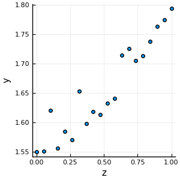
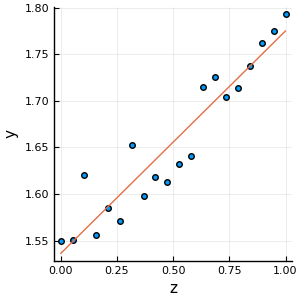

# **Least Squares**

In this lecture, we will cover least squares for data fitting, linear systems, properties of least squares and QR factorization.

## **Least squares for data fitting**

Consider the problem of fitting a line to observations $y_i$ gven input $z_i$ for $i = 1,\dots, n$. 

In the figure above, the data points seem to follow a linear trend. One way to find the parameters $c,s \in \R$ of the linear 
model $f(z) = s\cdot z + c$ that coresponds to a line of best fit is to minimize the following squared distance subject to a 
linear constraint:

$$
\begin{align*}
\min_{s,\,c,\,\hat{y}_i \in \R} &\sum_{i=1}^n (y_i - \hat{y}_i)^2\\
 \text{subject to } &s\cdot z_i+c = \hat{y}_i
\end{align*}
$$

The above minimization program can be reformulated as a linear least squares problem:

$$
\min_{\vx} \|\mA \vx - \vb\|_2^2 = \sum_{i=1}^n(\va_{i}^\intercal\vx-b_i)^2,
$$

where

$$
\mA = \begin{bmatrix}z_1 & 1\\ z_2 & 1\\ \vdots&\vdots\\z_n & 1\end{bmatrix}, \ \vb = \begin{bmatrix}y_1\\y_2\\\vdots
\\y_n\end{bmatrix}, \text{ and } \vx = \begin{bmatrix}s\\c\end{bmatrix}.
$$

Let 

$$
\begin{equation}\label{least_squares_problem}
\func{f}(\vx):=\frac{1}{2}\|\mA\vx-\vb\|_2^2 = \frac{1}{2}\sum_{i=1}^n(\va_{i}^\intercal\vx-b_i)^2.
\end{equation}
$$ 

The gradient and hessian of $\func{f}(\vx)$ are:

$$
\nabla\func{f}(\vx) = \mA^\intercal(\mA\vx-\vb), \text{ and } \nabla^2\func{f}(\vx) = \mA^\intercal\mA,
$$

respectively. The Hessian is positive semidefinite for every $\vx$ (and is positive definite if $\mA$ has full row rank). This 
implies that the function $\func{f}(\vx)$ is convex. Additionally, $\vx = \vx^{*}$ is a critical point if 

$$
\begin{equation}\label{least_square_normal_eqn}
\mA^\intercal(\mA\vx^*-b) = \vzero.
\end{equation}
$$

Since $\func{f}(\vx)$ is convex, $\vx^{*}$ is a global minimizer. Equation \eqref{least_square_normal_eqn} is called the normal 
equations of the least squares problem \eqref{least_squares_problem}. Solving the normal equations, we get the following line of 
best fit.

## **Linear systems**

Consider the problem of solving a linear system of equations. For $\mA \in \R^{m\times n}$ and $\vb\in\R^{m}$, the linear system
 of equations $\mA\vx = \vb$ is:

 1. overdetermined if $m>n$,
 2. underdetermined if $m< n$, or
 3. square if $m = n$.

 

A linear system can have exactly one solution, many solutions, or no solutions:

In general, a linear system $\mA\vx=\vb$ has a solution if $\vb \in \text{range} (\mA)$.

## **Properties of linear least squares**
Recall that the minimizer $\vx^*$ to the linear least squares poblem satisfies the normal equations:

$$
\mA^\intercal \mA \vx^* = \mA^\intercal\vb
$$

with the residual

$$
\vr^* = \mA\vx^* -\vb, 
$$
 
satisfying $\mA^\intercal\vr^* = \vzero.$ Here, $\mA \in \R^{m\times n}$. The minimzer of the linear least squares problem is 
unique if $\mA^\intercal\mA$ is invertible. However, the vector in the range of $\mA$ closest to $\vb$ is unique, i.e. 
$\vb^* = \mA\vx*$ is unique. Recall that range space of $\mA$ and the null space of $\mA^\intercal$ is:

$$
\text{range}(\mA) = \set{R}(\mA) = \{\vy : \vy = \mA \vx \text{ for some } \vx \}\\
\text{null}(\mA^\intercal)= \set{N}(\mA^\intercal) = \{\vz: \mA^\intercal\vz = \vzero\}
$$

By fundamental theorem of linear algebra, we have
$$
\begin{equation}\label{least_squares_FTLA}
\set{R}(\mA) \oplus \set{N}(\mA^\intercal) = \R^m.
\end{equation}
$$
Thus, for all $\vx \in \R^m$, we have

$$
\vx = \vu + \vv, \quad \vu \in \set{R}(\mA), \quad \vv\in\set{N}(\mA^\intercal)
$$

with $\vu$ and $\vv$ uniquely determined. This is illustrated in the figure below: 

Here, $\vx_{LS}$ is the least squares solution, $\mA = \begin{bmatrix}\va_1&\va_2&\dots&\va_n\end{bmatrix}$, 
with $\va_i \in \R^m$ for all $i$. Comparing with \eqref{least_squares_FTLA}, we get 
 
$$
\vb = \mA\vx_{LS}+r  \text{ with } 
\mA\vx_{LS} \in \set{R}(\mA) \text{ and } \vr \in \set{N}(\mA^\intercal)
$$
 
$\exa{1}$ What is the least-squares solution $\vx^*$ for the problem
 
$$
\min_{\vx} \frac{1}{2} \|\mA\vx - \vb\|_2^2,
$$

where 

$$
\mA = \begin{bmatrix} 1 \\ \vdots \\ 1 \end{bmatrix} = \ve \in \R^m \quad \text{ and } \quad 
\vb = \begin{bmatrix} b_1 \\ \vdots \\ b_m \end{bmatrix}.
$$

$\text{Solution:}$ First setup the normal equations:

$$
\mA^\intercal\mA\vx = \begin{bmatrix}1&\dots&1\end{bmatrix} \begin{bmatrix} 1 \\ \vdots \\ 1 \end{bmatrix}\vx = m\vx
\quad \text {and} \quad \mA^\intercal\vb = \begin{bmatrix}1&\dots&1\end{bmatrix} \begin{bmatrix} b_1 \\ \vdots \\ b_m 
\end{bmatrix} =\ve^\intercal\vb
$$

Solving the normal equations, we get 

$$
\mA^\intercal\mA\vx^* = \mA^\intercal\vb \iff m\vx^* = \ve^\intercal\vb \iff \vx^* = \frac{1}{m}\ve^\intercal\vb
$$

So, the least squares solution $\vx^*$ is the mean value of the elements in $\vb$.
